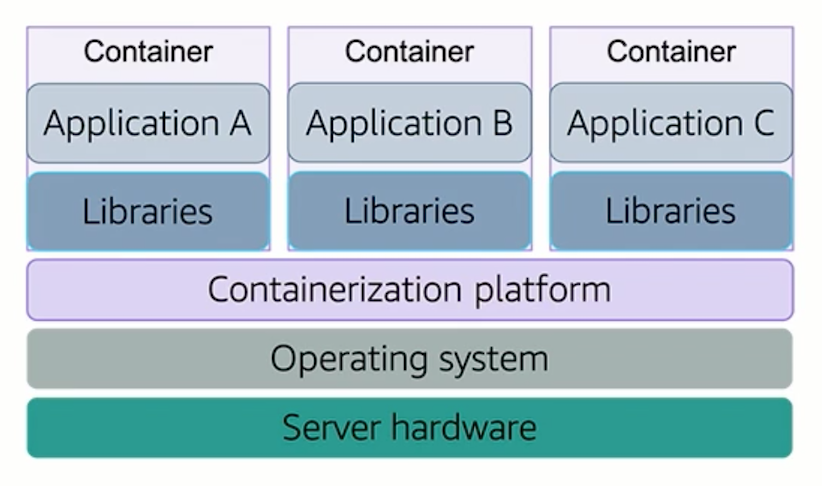

# Introduction to Containers

## What is a Container?



A **container** is a standardized unit of software that allows applications to run quickly and reliably across different 
computing environments.

It provides **operating system-level virtualization**, enabling lightweight, standalone packages that contain everything 
needed to run an application, including:

- Application code
- Runtime
- System tools
- Libraries
- Configuration files

A single host machine can run multiple containers. All containers on a host share the same underlying OS kernel but 
remain logically isolated from each other. These containers may represent individual services that are part of a larger 
application or entirely separate applications running in isolated environments.


## Virtualization and Abstraction

Containers abstract the application from the underlying infrastructure. This is similar to virtual machines, but 
containers are more lightweight and efficient because they do not require a full guest operating system. Instead, they 
share the host system’s OS kernel.


## Docker

**Docker** is a popular platform for building, running, and managing containers. It provides tools to:

- Define container images using a `Dockerfile`
- Build container images from source
- Run and manage containers
- Push and pull images from container registries (e.g., Docker Hub)

Docker uses a layered file system, which makes image builds fast and storage efficient.


## Images: Templates for Containers

A **Docker image** is a **read-only template** that includes instructions to create a container. It serves as the 
blueprint for your application environment.

A **container** is a **running instance** of that image. You can run one or multiple containers from the same image. 
Each container is isolated but based on the same configuration and dependencies.


## Dockerfile

A `Dockerfile` is a text file that contains a set of instructions for building a Docker image.

Example:

```Dockerfile
FROM python:3.12-slim
WORKDIR /app
COPY . /app
RUN pip install -r requirements.txt
CMD ["python", "app.py"]
```

## Docker Images vs. Containers

A **container image** is a read-only, immutable template that defines the environment and application configuration. It 
is highly portable and can be stored in a container registry (e.g., Docker Hub) for reuse across systems.

A **container** is a running instance of an image. When a container is started, a thin **read-write layer** is added on 
top of the image, allowing the application to run and make temporary changes.

This thin writable layer enables fast container startup and flexible execution. However, containers are **ephemeral** 
and **not designed for long-term data storage**.

To persist data beyond the lifecycle of a container, use **Docker volumes** or external storage systems.

> Consider containers as **disposable compute units**, not persistent storage solutions.

Each instruction in a `Dockerfile` creates a new **layer** in the image, contributing to efficient builds and caching.


## What is the Difference Between Containers and Virtual Machines?

| Feature           | Containers                          | Virtual Machines                    |
|-------------------|-------------------------------------|-------------------------------------|
| OS Layer          | Share host OS kernel                | Each has its own full OS            |
| Resource Usage    | Lightweight                         | Resource-intensive                  |
| Boot Time         | Fast                                | Slower                              |
| Isolation         | Process-level isolation             | Full machine-level isolation        |
| Storage Model     | Ephemeral by default                | Persistent by default               |
| Best Use Case     | Microservices, cloud-native apps    | Monolithic or legacy applications   |

