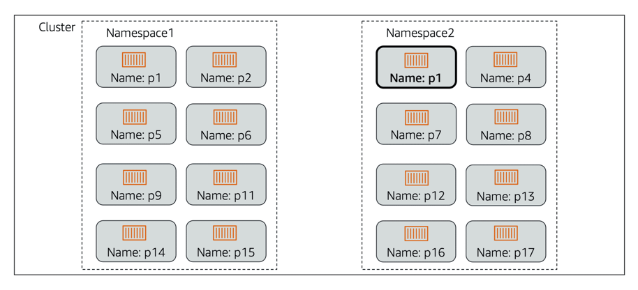
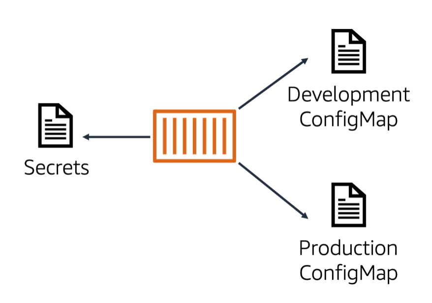

# Kubernetes Review

## Kubernetes Objects

### Cluster

A set of worker machines, called nodes, that run containerized applications. Every cluster has at least one worker node.
A cluster also has a control plane that runs services that manage the cluster.

### Node

Kubernetes runs your workload by grouping containers into pods and assigning those pods to run on nodes. 
A node can be a virtual or physical machine, depending on the cluster. Each node is managed by the control plane and 
contains the services necessary to run pods.

### Pod

A group of one or more containers. Pods are defined by a PodSpec file, a specification for how to run the containers. 
Pods are the basic building block within Kubernetes for deployment, scaling, and replication.

### Volume

#### Ephemeral volume
Applications in a pod have access to shared volumes to facilitate data sharing in the pod and persistence of data 
across container restarts. When a pod ceases to exist, Kubernetes destroys ephemeral volumes.

#### Persistent volume
A persistent volume functions similarly to an ephemeral volume but has a lifecycle independent of any individual pod 
that uses them. Persistent volumes are backed by storage subsystems independent of cluster nodes.

### Service

In Kubernetes, a service is a logical collection of pods and a means to access them. The service is continually updated
with the set of pods available, eliminating the need for pods to track other pods.

### Namespace

A virtual cluster that is backed by the same physical cluster. Physical clusters can have resources with the same name
as long as they are in different namespaces. Namespaces are especially useful when you have multiple teams or projects
using the same cluster.

### ReplicaSet

Ensures that a specific number of pod replicas are running at any given time.

### Deployment

Owns and manages ReplicaSets or individual pods. You describe a desired state in the deployment. The deployment then 
changes the actual state of the cluster to the desired state at a controlled rate.

### ConfigMap

A ConfigMap is an API object that stores nonconfidential data as key-value pairs used by other Kubernetes objects, such
as pods. Use ConfigMaps to follow the best practice of portability by separating your configuration data from your 
application code.

### Secrets

All confidential data, such as AWS credentials, should be stored as Kubernetes secrets. Secrets restrict access to 
sensitive information. Optionally, encryption can be turned on to improve security.

## Pod Scheduling

You can schedule pods with the Kubernetes scheduler. The scheduler checks the resources required by your pods and uses
that information to influence the scheduling decision. The scheduler runs a series of filters to exclude ineligible 
nodes for pod placement.

## Control Plane and Data Plane

> `Control plane`: Control plane nodes manage the worker nodes and the pods in the cluster.  
> `Data plane`: Worker nodes host the pods that are the components of the application workload.

### Control plane nodes

The control plane determines when tasks are scheduled and where they are routed to.  
The control plane includes:
* Control plane nodes
* Controller manager
* Cloud controller
* Scheduler
* API server
* etcd

#### Controller manager
The controller manager runs background threads called controllers that detect and respond to cluster events.

#### Cloud controller
The cloud controller is a specific controller that interacts with the underlying cloud provider.

#### Scheduler
The scheduler selects nodes for newly created containers to run on.

#### API server
The Kubernetes API server exposes the Kubernetes API and is the frontend for the Kubernetes control plane. It handles 
all communication from the cluster to the control plane; none of the other control plane components are designed to 
expose remote services. The Kubernetes API server is designed to scale horizontally, deploying more instances as 
necessary.

### etcd
This is the core persistence layer for Kubernetes.
It is a highly available distributed key value store. This is where the critical cluster data and state are stored.

#### Control/data plane communication
Communication between the control plane and worker nodes is done through the API server to kubelet.

### Data plane
In Kubernetes, the data plane is where the tasks are run. This is all done on your worker nodes.  
The data plane includes:
* Worker nodes
* kube-proxy
* Container runtime
* kubelet
* Pods

#### kube-proxy
This helps with networking. It maintains network rules on the host and performs any connection forwarding that 
may be necessary.

#### Container runtime
Kubernetes supports several runtimes, with Docker being the most common.

#### kubelet
This is the primary agent that runs on the worker nodes. Kubelet makes sure that the right containers are running in 
a pod and that they are healthy.

#### Pods
A pod is a group of one or more containers.
The containers in a pod are always colocated, scheduled together, and managed together; you cannot split containers in 
a pod across nodes.
Applications in a pod can easily communicate with each other. Like individual application containers, pods are 
considered to be relatively ephemeral (rather than durable) entities. This means that pods can disappear if they become 
unhealthy, and new ones can take their place.

## Custom resources
In addition to the resources that Kubernetes defines (such as pods and deployments), you can also extend the Kubernetes
API and create custom resources. A custom resource could be a new object, such as a service mesh object, or it can be
a combination of native Kubernetes resources. Custom resources are created with a Custom Resource Definition (CRD).

Custom resources can be controlled with custom controllers. Custom controllers run in pods on the worker nodes of your
cluster. When used to automate the management of custom resources in a cluster, custom controllers are referred to 
as operators. It is good practice to use operators instead of manually updating your native Kubernetes objects.

## kubectl
You can communicate with your control plane nodes using kubectl. kubectl is a command line interface (CLI) for 
communicating with the Kubernetes API server. It provides commands to create resources, view detailed information 
about the cluster and resources, and access troubleshooting tools. kubectl commands are used to roll out, scale, and 
automatically scale resources. 

Syntax:
`kubectl [command] [TYPE] [NAME] [flags]`

* Command: Specifies the operation you are performing.
* Type: Specifies the resource type.
* Name: Specifies the name of the resource.
* Flag: Specifies optional flags.

> What is the basic unit of deployment in Kubernetes?  
Pods are the basic building block within Kubernetes for deployment, scaling, and replication.

> What is a Kubernetes service?  
In Kubernetes, a service is a logical collection of pods and a means to access them. The service is continually 
updated with the set of pods available, eliminating the need for pods to track other pods.

