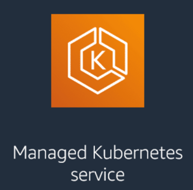

# Amazon EKS - Elastic Kubernetes Service

Kubernetes is a powerful system for orchestrating containers, often used to run microservices at scale. However, it can 
be complex to manage.  
**Amazon Elastic Kubernetes Service (Amazon EKS)** simplifies this by letting you run Kubernetes on AWS without needing 
to manage the control plane yourself.

## What is Amazon EKS?

**Amazon EKS** is a **managed Kubernetes service** that makes it easy to deploy, manage, and scale containerized 
applications on AWS or on-premises.  
It provides a **highly available** and **secure** Kubernetes control plane, and automates key tasks like:

- Cluster provisioning
- Node lifecycle management
- Patching and version upgrades

## Why Container Orchestration Matters

**Containers** package an application with its dependencies to ensure consistency across environments, from development 
to production.  
They are lightweight, portable, and ideal for building microservices or migrating legacy apps to the cloud.

However, running containers at scale requires automation. That’s where **container orchestration** comes in.

Container orchestration platforms help you:

- Deploy and schedule containers across clusters
- Scale containers up or down automatically
- Recover from failures by restarting unhealthy containers
- Connect containers to networking and storage
- Secure and monitor your container workloads

## Benefits of Amazon EKS

### Fully Managed Kubernetes

Amazon EKS runs and scales the **Kubernetes control plane** across multiple Availability Zones, removing the need to 
install or operate Kubernetes masters manually.  
EKS can also manage the **worker nodes** (data plane) if you choose.

### Integration with AWS Services

EKS works seamlessly with AWS tools like:

- **Elastic Load Balancing** for traffic distribution
- **AWS Identity and Access Management (IAM)** for access control and fine-grained permissions
- **Amazon Virtual Private Cloud (Amazon VPC)** for secure networking between pods and services

### Kubernetes-Conformant

Amazon EKS runs **upstream Kubernetes**, which means:

- You get full compatibility with Kubernetes tools and plugins
- You can migrate existing Kubernetes apps to EKS with no refactoring
- Your workloads will behave the same as in any standard Kubernetes environment

> What form of Kubernetes does Amazon Elastic Kubernetes Service (Amazon EKS) support?  
Amazon EKS runs native, upstream Kubernetes

