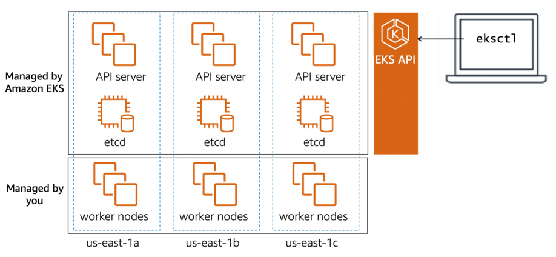

# Amazon EKS control plane

## Amazon EKS manages the Kubernetes control plane

In a standard Kubernetes deployment, you are responsible for designing, implementing, and maintaining all components of 
the control plane and the worker nodes.

Amazon EKS provides a scalable, highly available control plane. Amazon EKS automatically manages the availability and 
scalability of the Kubernetes API servers and the etcd persistence layer for each cluster.

This gives you more time to focus on running your application workloads in Kubernetes.

## Amazon EKS availability and API

The Amazon EKS control plane consists of at least two API server nodes and three etcd nodes across three Availability 
Zones. Amazon EKS automatically detects and replaces unhealthy control plane nodes, which removes a significant 
operational burden for running Kubernetes. With this capability, you can focus on building your applications instead of 
managing AWS infrastructure.

To get started with Amazon EKS, you provision your cluster of worker nodes. Amazon EKS handles the provisioning, scaling, 
and management of the Kubernetes control plane in a highly available and secure configuration. You then connect to the 
Amazon EKS cluster using the graphical or command line interface. After you’ve connected to the Amazon EKS cluster, 
you’re ready to deploy your Kubernetes applications to your Amazon EKS cluster. You can do this the same way that you 
would with any other Kubernetes environment.

Amazon EKS manages the Kubernetes control plane with the Amazon EKS API. You can use one of two CLIs to interact with 
the Amazon EKS API: `Amazon EKS CLI` or `eksctl`. With the `eksctl` command line utility, developed by Weaveworks, you can 
create and manage Kubernetes clusters on Amazon EKS. The `eksctl` utility uses AWS CloudFormation in the background to 
build clusters based on the options you specify.

## Review: Whose API am I using?
Working with two separate APIs and their respective tools adds complexity to managing your environment when getting 
started with Amazon EKS. Asking yourself the question, "Is this object directly controlled by Amazon EKS?" simplifies 
the next step to take. If the answer is yes, then use the Amazon EKS API to manage that object. For all other objects, 
use the Kubernetes API.

### Example: Amazon EKS API

You use the Amazon EKS API for anything that Amazon EKS manages. This includes the entire control plane (creating and 
managing the cluster).

| Task                                    | Sample Command                                                              |
|-----------------------------------------|-----------------------------------------------------------------------------|
| Create a cluster.                       | `eksctl create cluster`                                                     |
| Delete a managed node group.            | `eksctl delete nodegroup --cluster=${clusterName}  --name=${nodegroupName}` |
| Get the Fargate profile of the cluster. | `eksctl get fargateprofile --cluster ${clusterName}`                        |

Review [eksctl Docs](https://eksctl.io) for more examples.

### Example: Kubernetes API

Use the Kubernetes API for managing Kubernetes objects such as pods, deployments, and namespaces.

| Task                                          | Sample Command                       |
|-----------------------------------------------|--------------------------------------|
| Get a list of pods in the default namespace.  | `kubectl get pods`                   |
| Get a list of namespaces.                     | `kubectl get namespaces`             |
| Create a deployment in the default namespace. | `kubectl apply -f nginx-deploy.yaml` |

Review [Kubernetes Docs](https://kubernetes.io/docs/reference/generated/kubectl/kubectl-commands) for more examples.

> Which components are always managed by Amazon Elastic Kubernetes Service (Amazon EKS)?  
> The Kubernetes control plane.