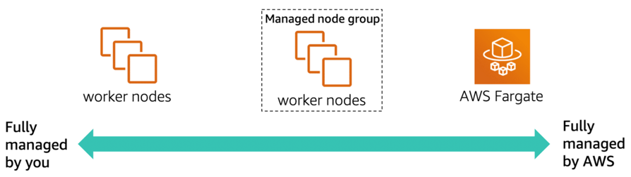
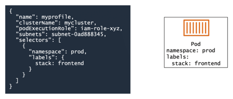

# Amazon EKS data plane

## Why have Amazon EKS manage your data plane?

Managing a complex infrastructure of many worker nodes and worrying about automatic scaling and updates is 
challenging. Additionally, you may have many different teams provisioning nodes in a cluster, and they might all be 
doing it differently. These differences make standardization difficult. By allowing Amazon EKS to manage some or all of 
your data plane, you can simplify your infrastructure and maintain standardization.

### Self-managed nodes

Only the control plane is managed by Amazon EKS. You completely control and manage your data plane nodes (including 
provisioning, updating, monitoring, and other tasks).

### Managed node groups

Managed node groups use the Amazon EKS API to start and manage the Amazon Elastic Compute Cloud (Amazon EC2) instances 
that run containers for an Amazon EKS cluster. Although the managed node groups are started and managed for you, you can 
still see all the resources being used in your AWS account, such as EC2 instances and Auto Scaling groups. You still get 
all the control, security, and visibility, with less work.

#### Provisioning

With one command, deploy a managed node group. Amazon EKS then creates nodes using the latest Amazon EKS optimized 
Amazon Machine Images (AMIs). The AWS service deploys them into multiple Availability Zones and backs them with an Auto 
Scaling group. You can change the scaling parameters.

#### Managing

Amazon EKS takes care of health monitoring of your managed node groups. Amazon EKS automatically informs you of issues, 
including required resources that are being deleted, are unreachable, or are unavailable. Amazon EKS also informs you of 
update issues, limits that are exceeded, and creation or deletion failures. You also can obtain logs from node-level 
Secure Shell (SSH) access, open source log routers, or Amazon CloudWatch. All managed node group events are also 
recorded in AWS CloudTrail.

#### Updating

With one command, you can update a managed node group when needed. Amazon EKS then handles the termination of the nodes 
for rolling updates and automatically updates to the latest AMI version for your Kubernetes version.

#### Scaling

Managed node groups take care of scaling your nodes for you. However, you still have control of the scaling parameters, 
such as Kubernetes labels, AWS tags, and the size of the node groups.

#### Tooling

You can use `eksctl` to provision managed node groups.

### AWS Fargate

With managed node groups, you spend less time on infrastructure management. But maybe you want to focus on creating 
your applications and have Amazon EKS fully manage your data plane. You can do this by running your pods on Fargate.

Fargate manages the complete infrastructure of your Kubernetes data plane. You need to worry only about running your 
pods.

* **Native** – Fargate runs native Kubernetes pods. No need to change or configure anything for AWS.
* **Rightsized** – Fargate dynamically provisions the resources you need for your pods and resources; no more, no less.
* **Fast and simple** – Fargate quickly scales for you. No need to set up a cluster autoscaler.
* **Optimized** – You pay only for the pods when they run, and you get pod-level billing visibility.

## Using Fargate

To use Fargate with Amazon EKS, you must create Fargate profiles.

Fargate profiles specify which pods should be scheduled on Fargate. You can choose to run all your pods on Fargate or 
only some. Fargate profiles use selectors, which include a namespace and labels. Any pods that match the namespace and 
all the labels of a selector in the profile are scheduled with Fargate.

Fargate profiles also specify the (private) subnets the pods will be launched into and the podExecutionRole, the IAM 
role that determines the permission the pod has to make calls to AWS APIs. This IAM role is also added to Kubernetes 
role-based access control (RBAC) for authorization.

## Comparing the data plane options

|                | Unmanaged Nodes | Managed Nodes        | Fargate         |
|----------------|-----------------|----------------------|-----------------|
| Units of work  | Pod and EC2     | Pod and EC2          | Pod             |
| Unit of charge | EC2             | EC2                  | Pod             |
| Host lifecycle | Customer        | AWS (SSH is allowed) | No visible host |
| Host:Pods      | 1 : many        | 1 : many             | 1 : 1           |

